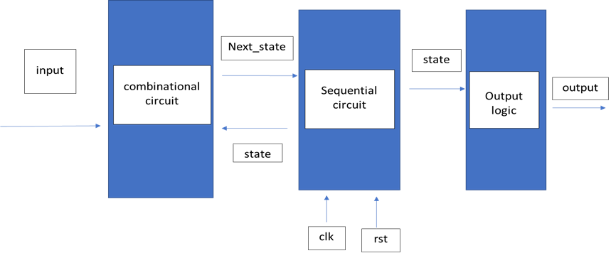
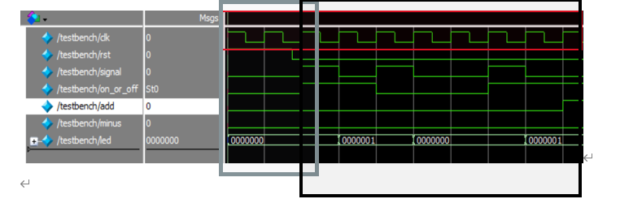

# Control Panel of Fan

## 構想：
現實生活中，電器產品增加了生活的方便性，而操作電器產品無非需要遙控器或是按鍵，當作觸發的開關。電器使用時，電路須保持通路，進而能夠繼續之後的操作；而關閉時，電路形成斷路，之後的任何操作並不會造成狀態的改變，除非電路再次形成通路。現在夏日當頭，電風扇無疑是許多的必要電器。注意到電風扇的燈號隨著按鍵的觸發，而改變顯示的數目，決定透過所學來實做此電路。

## 預期目標：
電源鍵的觸發能夠實現電器的開或關，當電路流通時，透過加減按鍵的輸入，使燈號的數目做增加或減少。而電路斷路時，任何加減按鍵的輸入，不會造成電路的增加，除非電源按鍵再次觸發，使電路形成通路。

## 實作方式：
本次實做電路，採用Moore finite state machine。此狀態機由組合電路和時序電路組成，每隔一個時脈，時序電路會給組合電路現在的狀態(state)，再透過輸入(input)，去得知下一個狀態(next_state)為何，而組合電路會給時序電路下一個狀態做儲存(下一個時脈的狀態)，輸出(output)只與現在的狀態(state)有關，與輸入(input)無關。

## 成果展示：

	時脈(clk)(紅色方框):先將時間單位參數化，每10ns秒為一次時脈周期，所以5ns為時脈的正負切換。

	重置鍵(rst)(灰色方框):一開始電路重置，重置鍵被觸發，rst = 1;經經過17.5ns秒(驗證是否為非同步電路設計)，重置未觸發，rst = 0。

	實現功能(黑色方框):此段測試當電源鍵每次被觸發(signal = 1)，是否會讓電路開啟(on_or_off = 1)或關閉(on_or_off = 0)，使電路與原先相反。測試當電路是開通的話，顯示的燈號為一顆(led = 0000001)，不然為關閉(led = 0000000)。

	實現功能:此段測試增加鍵的功能，當增加鍵觸發(add = 1)時，會在下一個時脈使led燈增加一個(紅色方框)，而在當燈號滿了，會使燈號停留在滿燈的狀態，不會再增加(led = 1111111)，所以會呈現兩個時脈(灰色方框)。

	實現功能:此段測試減少鍵的功能，當減少鍵觸發時(minus = 1)，會在下一個時脈使led燈減少一個(紅色方框)，而在當燈號剩下一個時，會使燈號停留在此狀態，不會在減少燈號 (led = 0000001) ，所以會呈現兩個時脈(灰色方框)。

	實現功能:此段測試隨機的增加或減少的功能(紅色方框)，並且測試當電源鍵再次被觸發(signal = 1)，電路為斷路(on_or_off = 0)，燈號不亮(led = 0000000)。並且測試當電路為斷路(on_or_off = 0)時，增加鍵(add = 1)或減少鍵(minus = 1)的觸發，都不會使燈號增加或減少。(維持在led = 0000000)(灰色方框)。

